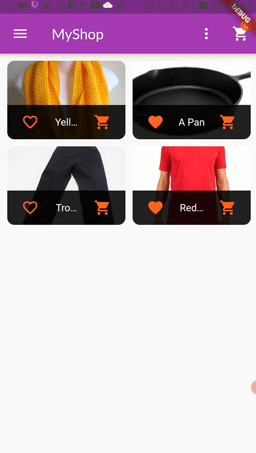

<h1 align="center">Flutter-TheShopApp</h1>
<a href="#">
  <div align="center" >
    
  </div>
</a>

## <h2 align = "center"> [Tap to see the video of this app](https://hirashahid.thecloudsoft.com/flutter-theshopapp/)</h2>

## What I have learnt:
- [x] A user need to sign up for using this app 
- [x] Once he is signed in, he can see all the products which are available and added by every user.
- [x] A user can add the product, edits and delete the product. 
- [x] User can also order the product and can see all the products available (added by all users). 
- [x] At the end, A user can also log out.

## What This App does:
- [x] State Management(Providers)
- [x] Storing data on server(firebase)
- [x] User authentication(tokens)
- [x] Animations 
- [x] Working with users input and forms 

## How To Run
```
git clone https://github.com/hirashahid/Flutter-TheShopApp
cd Flutter-TheShopApp
flutter run
```

## Author
You can get in touch with me on my LinkedIn Profile:

#### Hira Shahid
[](https://www.linkedin.com/in/thehirashahid)

You can also follow my GitHub Profile to stay updated about my latest projects: [](https://github.com/hirashahid)

If you liked the repo then kindly support it by giving it a star ⭐!

## LICENSE
- MIT (2021)
